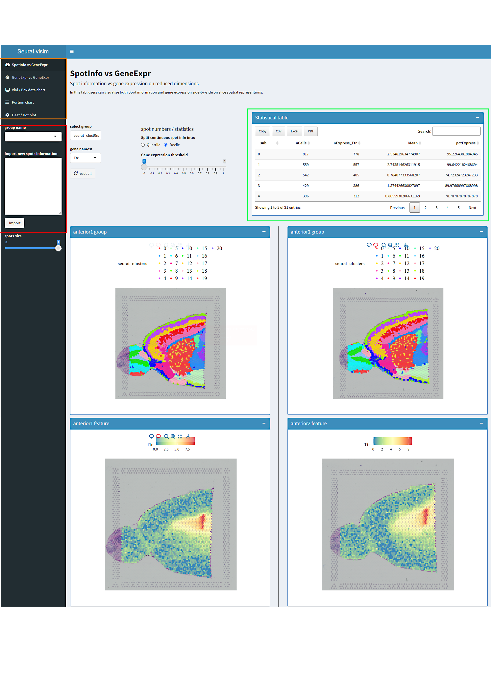

# shinySRT-guide

## Tutorials for creating ShinyCell interactive applications. Guidance on installing and using shinySRT
Here, we provide some tutorials and guidance on shinySRT:
### shinySRT package
ShinySRT is a web application developed utilizing the Shiny framework, explicitly designed for the sharable and interactive visualization of spatially resolved transcriptomics data. This application is adept at processing various formats of spatial transcriptome data, facilitating the development of an interactive interface conducive to thorough data analysis. The interactive interface of shinySRT is open-source, offering significant customization potential to align with the unique requirements of users.

Key features of shinySRT include:
-	Developed under R, utilizing a Shiny application that generates an interactive and shareable interface via the web. 
-	Provides compatibility with various prominent formats of spatial transcriptome data. 
-	Facilitates the import of multiple ST datasets into the Shiny web application. 
-	Allows for the customization of spatial spot selection. 
-	Supports multivariate comparisons, enabling the analysis of how the dependent variable changes across different groups of independent variables. 
-	Offers features for visualizing images and downloading data sheets. 
-	Simplifies the creation of the Shiny interface in a single step, and the Shiny app is entirely open source and customizable.

This file is broken down into the following section:
-	How to install shinySRT 
-	Quick Start Guide 
-	Functional Guidence. 

### How to install shinySRT
To begin, it’s important to verify whether the necessary installation packages for shinySRT have already been installed (The best version of R is 4.2 or above, to prevent some R packages are not good to install or incompatibility). ShinySRT can then be installed from GitHub as follows:

``` r
# If you employ Conda, it is imperative to install the essential packages requisite for the analysis of single-cell and spatial genomic data.
# mamba install conda-forge::r-cairo conda-forge::r-hdf5r conda-forge::r-curl conda-forge::r-devtools conda-forge::r-biocmanager conda-forge::r-rfast conda-forge::quadprog -y

if (!require('pacman')) install.packages('pacman')

BiocManager::install(c('scran','Seurat'))

devtools::install_github(c('YuLab-SMU/ggtree', 'silhouette99/shinySRT'))

pacman::p_load(
  'Cairo',
  'hdf5r',
  'data.table',
  'magrittr',
  'dplyr',
  'glue',
  'readr',
  'reticulate',
  'ggplot2',
  'graphics',
  'gridExtra',
  'patchwork',
  'RColorBrewer',
  'maps',
  'grid',
  'ggtree',
  'ggrepel',
  'ggdendro',
  'Matrix',
  'scales',
  'aplot',
  'keys',
  'ggiraph',
  'ggpubr',
  'shiny',
  'shinyhelper',
  'DT',
  'shinydashboard',
  'scran',
  'scatterpie',
  'quadprog',
  'Rfast',
  'SingleCellExperiment',
  'SpatialExperiment'
)

```

### Quick Start Guide
In summary, the shinySRT software package imports SRT objects and exports the required data, including expression matrices, metadata, spatial coordinates, etc., in a more compact standard format. shinySRT generates code based on the samples, all of which are necessary for the shiny app.
In the following example, we use publicly available SRT data provided by the 10x Genomics website, which is also utilized in the Seurat spatial transcriptomics data analysis tutorial.
A shiny app for spatial transcriptomics can be quickly generated following these steps:

``` r
library(Seurat)
library(SeuratData)
library(shinySRT)

InstallData("stxBrain")
brain <- LoadData("stxBrain", type = "anterior1")
brain2 <- LoadData("stxBrain", type = "anterior2")

dat <- merge(brain,brain2)

## Shinyapp will be create in 'example'
dir.create('example')
setwd('example')

CreateshinySRT(brain,title = 'shinySRT exmaple', sp_normalize = F, gene.mapping = F)

# run shiny app 
shiny::runApp('shinyspatial_app/')

```

The generated shiny app can be found in the directory ‘shinyspatial_app’ under the current directory. To locally run the shiny app, you can use the command shiny::runApp('shinyspatial_app/'). Additionally, you can deploy it on online platforms such as shinyapps.io or host it on a server.


