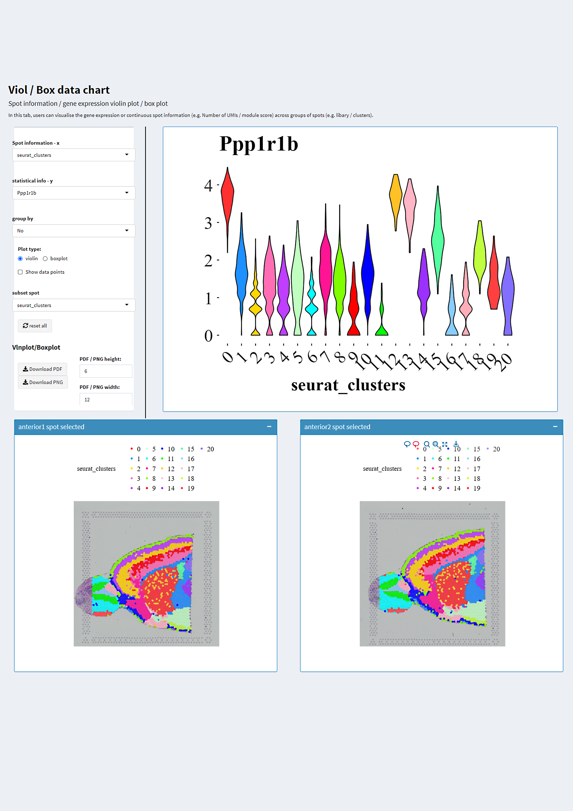
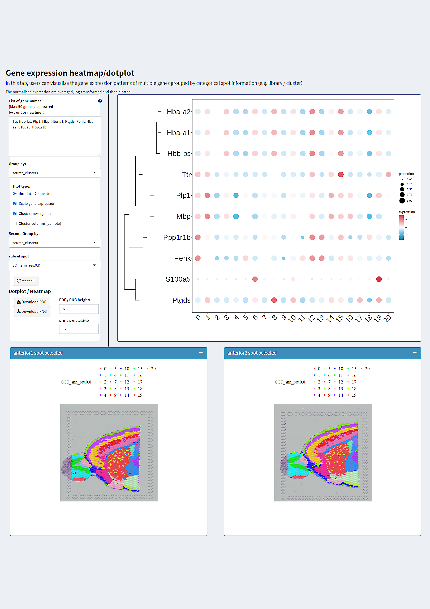

# shinySRT-guide

## Tutorials for creating ShinyCell interactive applications. Guidance on installing and using shinySRT
Here, we provide some tutorials and guidance on shinySRT:
### shinySRT package
ShinySRT is a web application developed utilizing the Shiny framework, explicitly designed for the sharable and interactive visualization of spatially resolved transcriptomics data. This application is adept at processing various formats of spatial transcriptome data, facilitating the development of an interactive interface conducive to thorough data analysis. The interactive interface of shinySRT is open-source, offering significant customization potential to align with the unique requirements of users.

Key features of shinySRT include:
-	Developed under R, utilizing a Shiny application that generates an interactive and shareable interface via the web. 
-	Provides compatibility with various prominent formats of spatial transcriptome data. 
-	Facilitates the import of multiple ST datasets into the Shiny web application. 
-	Allows for the customization of spatial spot selection. 
-	Supports multivariate comparisons, enabling the analysis of how the dependent variable changes across different groups of independent variables. 
-	Offers features for visualizing images and downloading data sheets. 
-	Simplifies the creation of the Shiny interface in a single step, and the Shiny app is entirely open source and customizable.

This file is broken down into the following section:
-	How to install shinySRT 
-	Quick Start Guide 
-	Functional Guidence. 

### How to install shinySRT
To begin, it’s important to verify whether the necessary installation packages for shinySRT have already been installed (The best version of R is 4.2 or above, to prevent some R packages are not good to install or incompatibility). ShinySRT can then be installed from GitHub as follows:

``` r
# If you employ Conda, it is imperative to install the essential packages requisite for the analysis of single-cell and spatial genomic data.
# mamba install conda-forge::r-cairo conda-forge::r-hdf5r conda-forge::r-curl conda-forge::r-devtools conda-forge::r-biocmanager conda-forge::r-rfast conda-forge::quadprog -y

if (!require('pacman')) install.packages('pacman')

BiocManager::install(c('scran','Seurat'))

devtools::install_github(c('YuLab-SMU/ggtree', 'silhouette99/shinySRT'))

pacman::p_load(
  'Cairo',
  'hdf5r',
  'data.table',
  'magrittr',
  'dplyr',
  'glue',
  'readr',
  'reticulate',
  'ggplot2',
  'graphics',
  'gridExtra',
  'patchwork',
  'RColorBrewer',
  'maps',
  'grid',
  'ggtree',
  'ggrepel',
  'ggdendro',
  'Matrix',
  'scales',
  'aplot',
  'keys',
  'ggiraph',
  'ggpubr',
  'shiny',
  'shinyhelper',
  'DT',
  'shinydashboard',
  'scran',
  'scatterpie',
  'quadprog',
  'Rfast',
  'SingleCellExperiment',
  'SpatialExperiment'
)

```

### Quick Start Guide
In summary, the shinySRT software package imports SRT objects and exports the required data, including expression matrices, metadata, spatial coordinates, etc., in a more compact standard format. shinySRT generates code based on the samples, all of which are necessary for the shiny app.
In the following example, we use publicly available SRT data provided by the 10x Genomics website, which is also utilized in the Seurat spatial transcriptomics data analysis tutorial.
A shiny app for spatial transcriptomics can be quickly generated following these steps:

``` r
library(Seurat)
library(SeuratData)
library(shinySRT)

InstallData("stxBrain")
brain <- LoadData("stxBrain", type = "anterior1")
brain2 <- LoadData("stxBrain", type = "anterior2")

dat <- merge(brain,brain2)

## Shinyapp will be create in 'example'
dir.create('example')
setwd('example')

CreateshinySRT(brain,title = 'shinySRT exmaple', sp_normalize = F, gene.mapping = F)

# run shiny app 
shiny::runApp('shinyspatial_app/')

```

The generated shiny app can be found in the directory ‘shinyspatial_app’ under the current directory. To locally run the shiny app, you can use the command shiny::runApp('shinyspatial_app/'). Additionally, you can deploy it on online platforms such as shinyapps.io or host it on a server.


The visualization interface generated by ShinySRT mainly consists of five sections, demonstrating the primary spatial transcriptomics data statistics and visualizations. The image below shows the standard interface of ShinySRT, featuring a sidebar on the left. This sidebar includes sections for toggling between different modules (highlighted in orange), as well as an input area for importing new spatial annotation information into the metadata of the interface (highlighted in red). As shown in the above figure, the first module of the interface is used to display the relationship between the spatial annotation information of spots and gene expression. By adjusting the "select group" and "gene names" options, you can display this information in the spatial plot below. The upper spatial plot with discontinuous colors shows the annotation information of the spots, with each color representing a different group. The lower spatial plot with gradient colors shows the gene expression levels, with color intensity reflecting the expression strength. The spatial plots are interactive, allowing for the selection of specific regions for further localized studies. The "Statistical table" shows the gene expression levels in the spots. The "sub" column in the table can be changed through the "select group" option. In the example, the "select group" option is set to "seurat_clusters," so the spatial plot below shows the spatial distribution of the seurat_clusters groups, and the statistical table shows the gene expression levels in these groups. The 'nCells' column indicates the number of spots in each group, the "nExpress_(gene name)" column indicates the number of spots in each group where gene expression exceeds the threshold (threshold = max(gene expression) * Gene expression threshold), the "Mean" column indicates the average gene expression level in each group, and "pctExpress" = "nExpress_(gene name)"/"nCells".


The second module focuses on the relationship between genes, specifically the statistical and visual representation of the co-expression of two genes. In this module, there are spatial plots that display metadata grouping information as well as gene co-expression plots, with color gradients reflecting the levels of co-expression. This module allows for adjusting the expression thresholds of two genes to determine if they are co-localized in spots. At the top, the spatial plot shows annotation information, while the spatial plot at the bottom displays the co-expression of the two genes. In the legend, red represents the expression of gene 1, green represents the expression of gene 2, and yellow indicates co-expression. The "Gene1 expression threshold" and "Gene2 expression threshold" functions are similar to the "Gene expression threshold" in the first module. The interface table shows the co-localization of the two genes (Ttr > 0: the number of spots where Ttr expression is greater than 0 and Hbb-bs = 0; Ptgds > 0: the number of spots where Hbb-bs expression is greater than 0 and Ttr = 0; Both: the number of spots where both Ttr and Hbb-bs expressions are greater than 0; None: the number of spots where both Ttr and Hbb-bs expressions are equal to 0). The violin plot reflects the co-expression scores of the two genes, with the X-axis representing groups that can be adjusted using the "Add group" function, and the Y-axis showing the co-expression scores (√(gene1*gene2)). The violin plot can also display localized gene co-expression by selecting spots on the spatial plot.


The third module visualizes the statistical results of gene expression. It utilizes vlnplot and boxplot to display the statistical results, with the x-axis representing different annotation information. In this module, the spatial plot at the bottom still displays annotation information and is primarily used for local selection and analysis within the current module. The violin plot or box plot is located above, with the X-axis representing different annotations and the Y-axis representing gene expression. The menu on the left side of the violin plot allows for changing the X and Y axes and modifying the type of plot displayed. In addition to changing the meanings of the X and Y axes, a third variable can be added for multi-factor comparison using the "group by" function. For example, we can observe gene expression in each subgroup and understand differences between samples. In this case, by selecting "slice_sample" in the "group by" option, we can explore differences between subgroups within each sample while also examining differences across samples.


The fourth module provides a bar chart to visualize the proportional statistics of annotation information across different groups. This module's structure is similar to the third module.




The fifth module displays gene expression patterns in different regions through a “bubble chart or heatmap.” It also allows for clustering along both rows and columns. The heat map and dot plot are similar to the statistical plots in previous modules, exploring differences between subgroups while also investigating differences among subgroups within each sample. "Group by" is used to determine the x-axis of the dot plot/heatmap. "Second Group by" can add a second variable. For example, in the dot plot shown here, each cluster's gene expression is displayed. When we select "slice_sample" in "Second Group by", the dot plot will display the gene expression of each cluster in different samples.

Based on the interface description above, it is evident that shinySRT is a comprehensive tool for visualizing SRT (Spatial Transcriptomics) data. The shinySRT interface supports the simultaneous display of multiple ST (Spatial Transcriptomics) samples and facilitates cross-sample comparisons. This functionality is crucial for both data analysis and visualization, providing significant biological insights. The ability to showcase multiple samples and perform cross-sample comparisons is particularly important in understanding biological variations and responses.
To illustrate this, we use previously mentioned public datasets (S2 File) that include three samples: brain slices from mice in a resting state shortly after Brucella infection, brain slices from mice at the central nervous system disease onset stage (25 days post-infection), and brain slices from mice at the stage of neurological symptom manifestation (45 days post-infection). These samples are used to investigate the transcriptional and functional responses of the brain to chronic Brucella infection. The display of multiple samples and the ability to compare across these samples allow researchers to uncover differences in the brain's state at various stages of infection. This comparative approach can reveal how the brain's transcriptional landscape and cellular functions evolve from the initial infection through to the manifestation of disease symptoms, providing critical insights into the progression and impact of chronic Brucella infection. 
In the "SpotInfo vs GeneExpr" module, we examine the expression of genes across different slices in three samples, focusing on infection-related genes (Aif1, Adgre1, Arg1, and Chil3) and their correlation with infection status (illustrated in the top graph of the bottom image). The "Statistical table" can display the gene expression status of selected spots. In the shinySRT interface, which includes multiple samples, users can view cross-sample gene expression by selecting "slice_sample" in the "select group" section (highlighted in green below). This will update the "Statistical table" to show gene expression statuses for the two samples (highlighted in orange below). For localized comparison between two samples, such as examining infection-related gene expression in the cortex area, users can directly select the region on the spatial map. The "Statistical table" will then display the localized gene expression data accordingly (highlighted in red at the bottom).


In the "GeneExpr vs GeneExpr" module, the co-expression of two genes can be displayed. The image below shows the co-localization of Tb927.6.4280 and Ttr (Tb927.6.4280: a specific gene of Brucella, Ttr: a marker gene of circumventricular organs, with Brucella infection tending to localize to these organs). The statistical table (highlighted in orange) and the violin plot (Coexp Score = √(gene1*gene2)) can display the co-expression status of these two genes. By default, the "Add group" setting is set to "No" (highlighted in the green box at the top), and the chart shows the co-expression state of genes across multiple samples without distinguishing between them, resulting in a violin plot without sample or group differentiation. When the "Add group" option is switched to "slice_sample" (highlighted in the green box at the bottom), an additional column is added to the chart (highlighted in red), which distinguishes between different samples. The chart then displays the gene co-expression status for each sample separately and generates violin plots for different samples. As the infection progresses, it localizes to the circumventricular organs and stabilizes over time.


The "Viol/Box data chart" module allows switching "Spot information – x" to "slice_sample" (highlighted in the red box), enabling violin plots to display gene expression patterns across different samples and perform localized comparisons. Additionally, shinySRT can incorporate new variables for comparison (highlighted in the orange box). The functionality of the gene expression heatmap/dot plot module is similar to that of the aforementioned module. In summary, shinySRT not only displays multiple samples within the same interface but also facilitates cross-sample comparisons.


### Functional Guidence
In addition to its core functionalities, shinySRT also incorporates additional features for user convenience and usability. Here, we provide further details.
### add_meta
Users can add new metadata through the add_meta function. Once added, the new metadata options can be found in the dropdown menu.

``` r
library(blockrand)
setwd('example')
meta <- readRDS('meta.Rds')

## randomly generate a new metadata
new_meta <- blockrand(n=nrow(meta), num.levels = 5, levels = c("1cluster","2cluster",'3cluster','4cluster','5cluster'))

## add ‘treatment’ group into the meta.Rds and meta_group.Rds
add_meta(new_meta, dirs = "shinyspatial_app", colname = "treatment")
```


